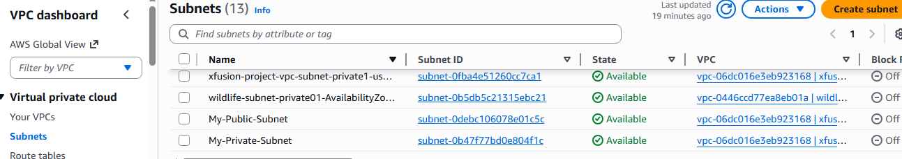
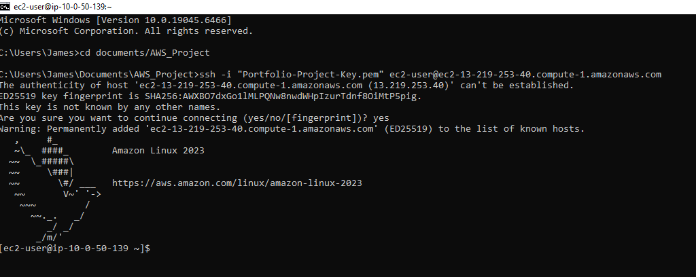
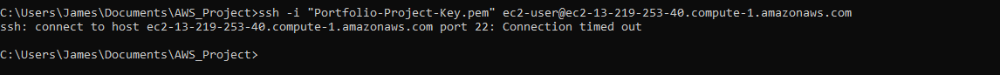
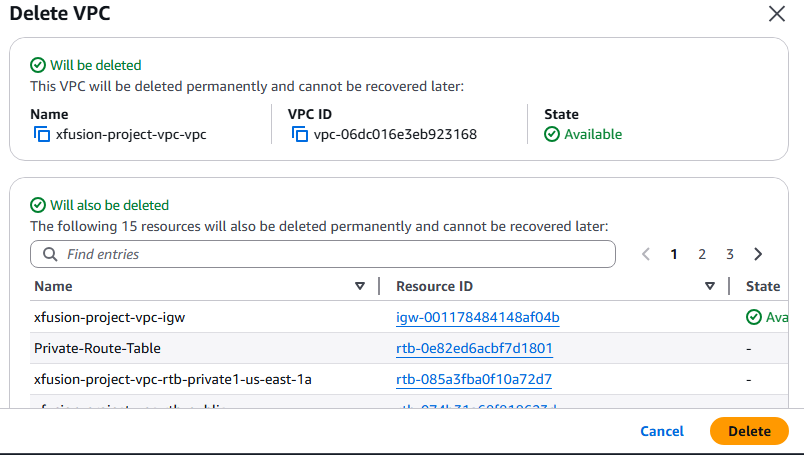

Secure Two-Tier AWS Infrastructure Lab
## Project Overview
In this lab, I designed and deployed a secure, segmented network on AWS. This architecture features a Public Subnet for management and a Private Subnet for isolated workloads, demonstrating core cloud security principles like Layered Defense and Least Privilege.

### 1. Network Topology & Segmentation
I established a custom VPC (10.0.0.0/16) and partitioned it into public and private tiers.

The Blueprint: 

The Logic: This separation ensures that sensitive resources (like databases) have no direct path to the public internet.

### 2. Routing & Connectivity
I configured an Internet Gateway (IGW) and updated the Public Route Table to allow egress traffic.

The Configuration: 

The Result: Only the public instance can communicate with the outside world.

### 3. Access Validation (The Success)
Using a secure SSH key pair, I successfully established a remote session to the public "Bridge" instance.

The Proof: 

The Evidence: The [ec2-user@ip-...] prompt confirms the network, routing, and security groups are correctly aligned.

### 4. Security Audit: Chaos Testing
To verify the Stateful Firewall (Security Groups), I intentionally removed the Port 22 inbound rule.

The Test: 

The Result: Confirmed that unauthorized access attempts were successfully dropped by the firewall.

### 5. Environment Decommissioning
As a best practice for cost management and security hygiene, the environment was fully dismantled upon completion.

The Teardown: 

